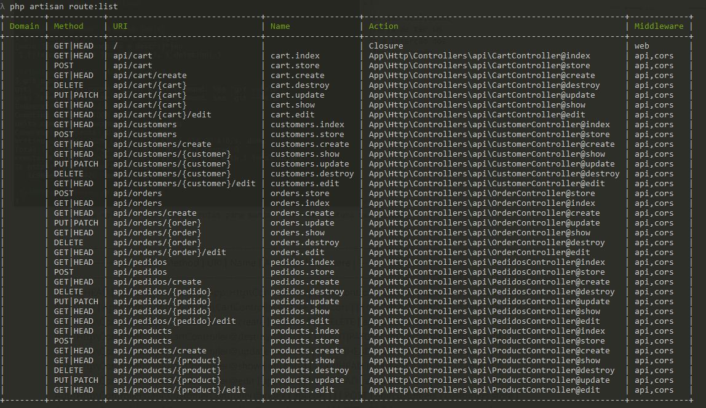

# Teste dev - PDV – Fast Food

## Descrição

    Um restaurante precisa registrar suas vendas de forma fácil e rápida. São utilizadas
    comandas para anotar os pedidos de seus clientes. O restaurante gostaria de ter um
    ambiente intuitivo, listando os produtos mais vendidos e facilitando a inserção dos
    mesmos em um checkout. O restaurante também gostaria de um visual simples, porém
    moderno.

## Front

    Desenvolvido em Vue.js 2

### Rotas

    Precisa melhorar muito essas rotas para manter uma nomenclatura mais coesa

## Back

    Desenvolvido em Laravel 6

