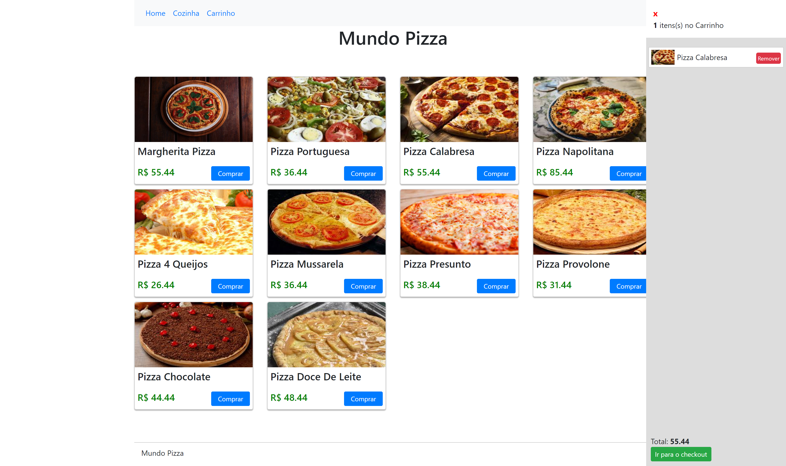

# Teste dev - PDV – Fast Food

## Descrição

    Um restaurante precisa registrar suas vendas de forma fácil e rápida. São utilizadas
    comandas para anotar os pedidos de seus clientes. O restaurante gostaria de ter um
    ambiente intuitivo, listando os produtos mais vendidos e facilitando a inserção dos
    mesmos em um checkout. O restaurante também gostaria de um visual simples, porém
    moderno.

## Front

    Desenvolvido em Vue.js 2

### Rotas

    Precisa melhorar muito essas rotas para manter uma nomenclatura mais coesa

+--------+-----------+-------------------------------+-------------------+-----------------------------------------------------+------------+
| Domain | Method    | URI                           | Name              | Action                                              | Middleware |
+--------+-----------+-------------------------------+-------------------+-----------------------------------------------------+------------+
|        | GET|HEAD  | /                             |                   | Closure                                             | web        |
|        | GET|HEAD  | api/cart                      | cart.index        | App\Http\Controllers\api\CartController@index       | api,cors   |
|        | POST      | api/cart                      | cart.store        | App\Http\Controllers\api\CartController@store       | api,cors   |
|        | GET|HEAD  | api/cart/create               | cart.create       | App\Http\Controllers\api\CartController@create      | api,cors   |
|        | DELETE    | api/cart/{cart}               | cart.destroy      | App\Http\Controllers\api\CartController@destroy     | api,cors   |
|        | PUT|PATCH | api/cart/{cart}               | cart.update       | App\Http\Controllers\api\CartController@update      | api,cors   |
|        | GET|HEAD  | api/cart/{cart}               | cart.show         | App\Http\Controllers\api\CartController@show        | api,cors   |
|        | GET|HEAD  | api/cart/{cart}/edit          | cart.edit         | App\Http\Controllers\api\CartController@edit        | api,cors   |
|        | GET|HEAD  | api/customers                 | customers.index   | App\Http\Controllers\api\CustomerController@index   | api,cors   |
|        | POST      | api/customers                 | customers.store   | App\Http\Controllers\api\CustomerController@store   | api,cors   |
|        | GET|HEAD  | api/customers/create          | customers.create  | App\Http\Controllers\api\CustomerController@create  | api,cors   |
|        | GET|HEAD  | api/customers/{customer}      | customers.show    | App\Http\Controllers\api\CustomerController@show    | api,cors   |
|        | PUT|PATCH | api/customers/{customer}      | customers.update  | App\Http\Controllers\api\CustomerController@update  | api,cors   |
|        | DELETE    | api/customers/{customer}      | customers.destroy | App\Http\Controllers\api\CustomerController@destroy | api,cors   |
|        | GET|HEAD  | api/customers/{customer}/edit | customers.edit    | App\Http\Controllers\api\CustomerController@edit    | api,cors   |
|        | POST      | api/orders                    | orders.store      | App\Http\Controllers\api\OrderController@store      | api,cors   |
|        | GET|HEAD  | api/orders                    | orders.index      | App\Http\Controllers\api\OrderController@index      | api,cors   |
|        | GET|HEAD  | api/orders/create             | orders.create     | App\Http\Controllers\api\OrderController@create     | api,cors   |
|        | PUT|PATCH | api/orders/{order}            | orders.update     | App\Http\Controllers\api\OrderController@update     | api,cors   |
|        | GET|HEAD  | api/orders/{order}            | orders.show       | App\Http\Controllers\api\OrderController@show       | api,cors   |
|        | DELETE    | api/orders/{order}            | orders.destroy    | App\Http\Controllers\api\OrderController@destroy    | api,cors   |
|        | GET|HEAD  | api/orders/{order}/edit       | orders.edit       | App\Http\Controllers\api\OrderController@edit       | api,cors   |
|        | GET|HEAD  | api/pedidos                   | pedidos.index     | App\Http\Controllers\api\PedidosController@index    | api,cors   |
|        | POST      | api/pedidos                   | pedidos.store     | App\Http\Controllers\api\PedidosController@store    | api,cors   |
|        | GET|HEAD  | api/pedidos/create            | pedidos.create    | App\Http\Controllers\api\PedidosController@create   | api,cors   |
|        | DELETE    | api/pedidos/{pedido}          | pedidos.destroy   | App\Http\Controllers\api\PedidosController@destroy  | api,cors   |
|        | PUT|PATCH | api/pedidos/{pedido}          | pedidos.update    | App\Http\Controllers\api\PedidosController@update   | api,cors   |
|        | GET|HEAD  | api/pedidos/{pedido}          | pedidos.show      | App\Http\Controllers\api\PedidosController@show     | api,cors   |
|        | GET|HEAD  | api/pedidos/{pedido}/edit     | pedidos.edit      | App\Http\Controllers\api\PedidosController@edit     | api,cors   |
|        | GET|HEAD  | api/products                  | products.index    | App\Http\Controllers\api\ProductController@index    | api,cors   |
|        | POST      | api/products                  | products.store    | App\Http\Controllers\api\ProductController@store    | api,cors   |
|        | GET|HEAD  | api/products/create           | products.create   | App\Http\Controllers\api\ProductController@create   | api,cors   |
|        | GET|HEAD  | api/products/{product}        | products.show     | App\Http\Controllers\api\ProductController@show     | api,cors   |
|        | DELETE    | api/products/{product}        | products.destroy  | App\Http\Controllers\api\ProductController@destroy  | api,cors   |
|        | PUT|PATCH | api/products/{product}        | products.update   | App\Http\Controllers\api\ProductController@update   | api,cors   |
|        | GET|HEAD  | api/products/{product}/edit   | products.edit     | App\Http\Controllers\api\ProductController@edit     | api,cors   |
+--------+-----------+-------------------------------+-------------------+-----------------------------------------------------+------------+

## Back

    Desenvolvido em Laravel 6

